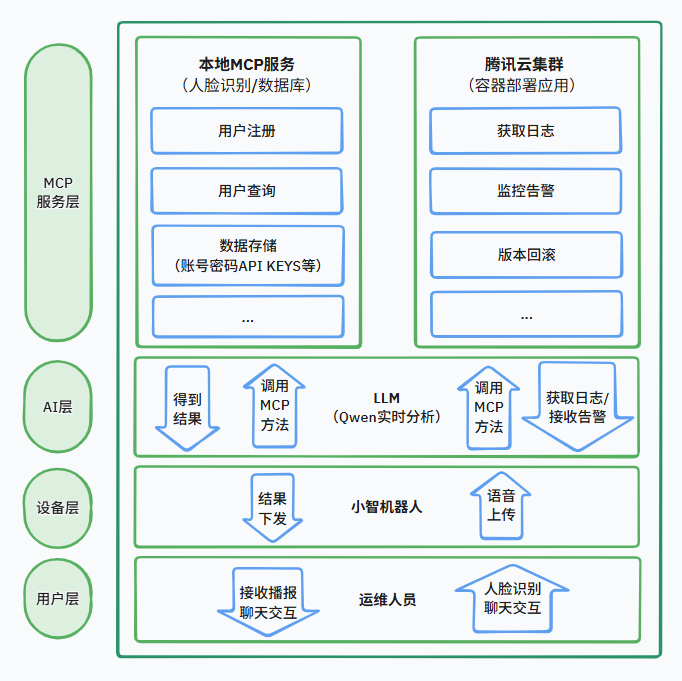

**前两周准备阶段总结：**

1. 采购方面：确定了所有要采购的产品并进行了第一批采购。
2. 腾讯云部分：调研需要用到的腾讯云产品以及是否已有MCP方法，计划后续使用API构建MCP。
3. 小智机器人：在开源方案的基础上增加了电机和摄像头（用于人脸识别验证身份），完成硬件的选型，对摄像头进行初步开发。
4. MCP部分：实现小智机器人通过接入点接入新的MCP方法。
5. 构思了整体的设计框架。

**7月14日进展：**

1. 确定并完成第一批购买；
2. 了解容器应用的部署；
3. 对摄像头进行初步开发（未成功），尝试获取摄像头保存数据；
4. 确定分工：
    1. 黄乐瑶：调研API的种类要用到的参数，用户的key，用户名，密码…，挑选并部署个应用，能看日志。（周三晚之前）。
    2. 唐源：首先，打印图片的数据给我，（周三晚之前）试固件（yolo能用的那个），在原本的固件上做到实时识别人脸。（周六晚之前）。
    3. 李钢：场景设计（周六晚之前大致完成20个），数据库以及基础的MCP（周六晚之前）。

**仓库地址：**https://github.com/WARDEN-DEV/Tencent-Mini

**设计框架：**

**余留问题：**

1. 提示词的设计(参考逆向工程)
2. MCP的双工

