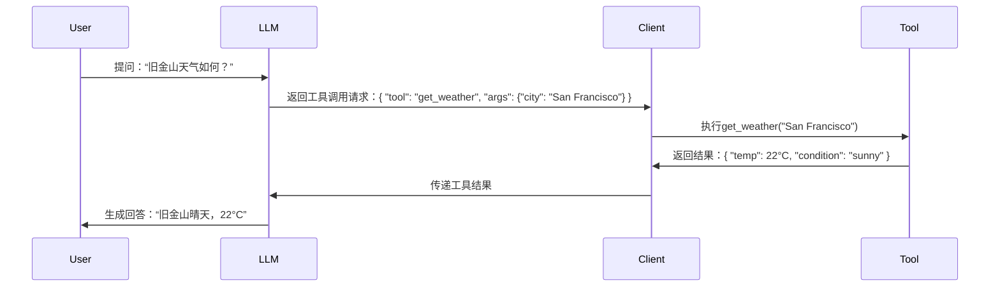
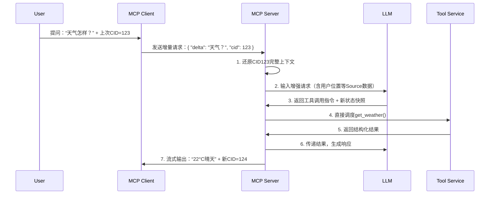
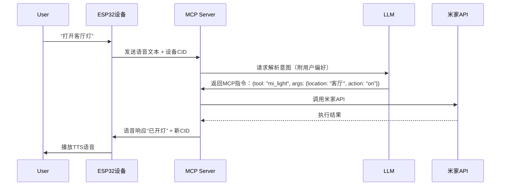
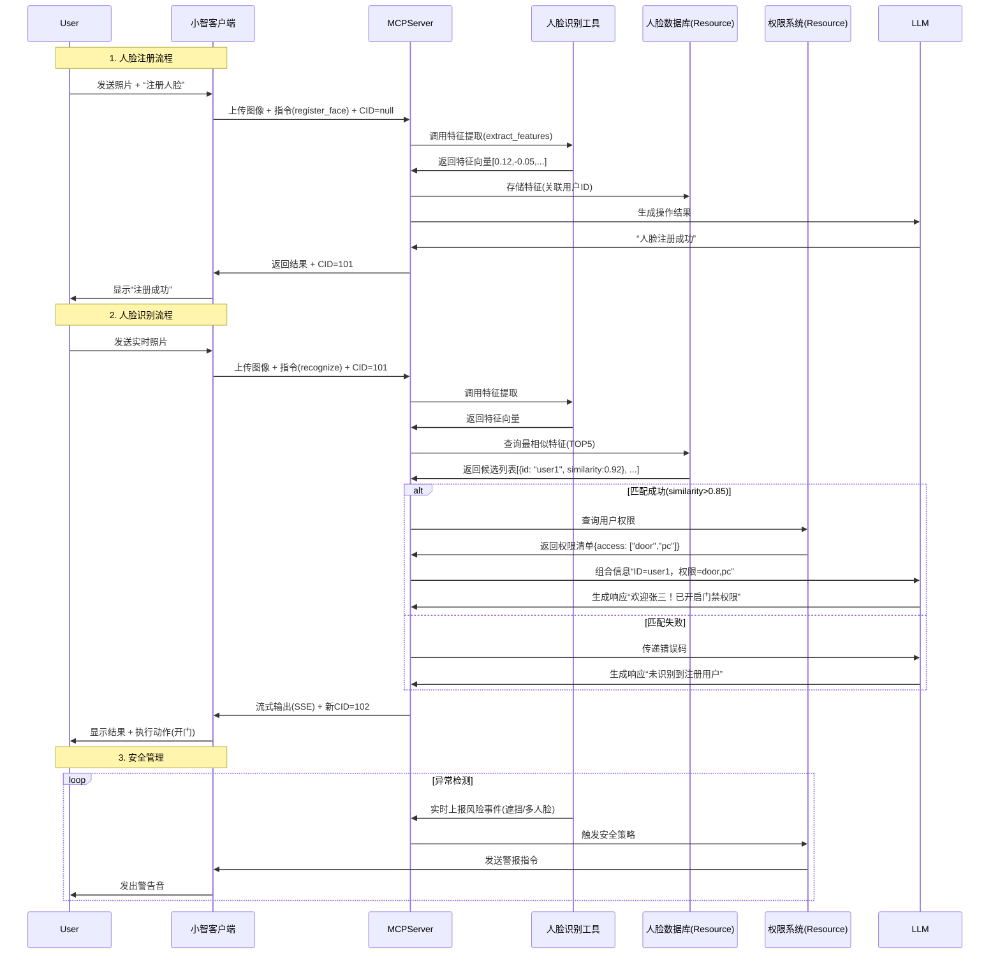

# MCP初步了解

## 三大核心组件 

MCP 通过三大基础元素标准化模型与外部系统的交互：

| **元素**              | **控制方**              | **功能定位**                                                 | **典型应用场景**                       |
| :-------------------- | :---------------------- | :----------------------------------------------------------- | :------------------------------------- |
| **资源（Resources）** | 应用控制（Application） | 提供结构化的数据源（如文件、API 响应、数据库内容）           | 文件读取、数据库查询、API 结果注入     |
| **工具（Tools）**     | 模型控制（Model）       | 提供可被 LLM 调用的函数，执行外部操作（如计算、发送邮件、执行命令） | 发送邮件、调用 API、执行代码、操作文件 |
| **提示（Prompts）**   | **用户控制（User）**    | **提供预定义的交互模板，引导用户或模型完成特定任务**         | 任务引导、标准化交互、多轮流程设计     |

### 一、**MCP 中的 Source（数据源）**

**作用**：为模型提供**结构化、可动态更新的上下文输入**，替代传统人工拼接的文本片段。
**关键特性**：

| 特性           | 说明                                                         |
| :------------- | :----------------------------------------------------------- |
| **声明式接入** | 通过协议描述数据来源（如数据库、API、文档），无需硬编码到提示词中。 |
| **动态加载**   | 根据对话状态按需拉取数据，避免传输全量内容。                 |
| **优先级控制** | 支持定义多个 Source 的权重或顺序，影响模型对上下文的关注度。 |

**常见 Source 类型**：

1. **知识库检索器**
   - 示例：`{ "type": "vector_db", "query": "当前用户问题", "top_k": 3 }`
   - 行为：自动从向量数据库检索相关片段，作为上下文注入。
2. **实时API数据**
   - 示例：`{ "type": "rest_api", "endpoint": "https://api/stock/price", "params": { "symbol": "AAPL" } }`
   - 行为：调用外部 API 获取实时股价，结果自动格式化后传入模型。
3. **用户会话记忆**
   - 示例：`{ "type": "memory", "key": "user_preferences", "default": "{}" }`
   - 行为：从持久化存储中提取用户历史偏好（如“喜欢素食”）。

------

### 二、**MCP 中的 Tool（工具）**

**作用**：将模型**无法直接执行的任务**（如计算、代码执行、设备控制）**委托给外部工具**，并通过协议标准化交互流程。
**关键特性**：

| 特性             | 说明                                                    |
| :--------------- | :------------------------------------------------------ |
| **能力声明**     | 工具需预先描述功能、输入参数格式（类似 OpenAPI 规范）。 |
| **按需调用**     | 模型根据需求生成工具调用请求，而非硬编码触发。          |
| **结果自动整合** | 工具执行结果由 MCP 框架自动回传模型，用于继续生成回答。 |

**常见 Tool 类型**：

1. **计算工具**
   - 示例：`{ "name": "math_calculator", "args": { "expression": "sqrt(9)+2" } }`
   - 行为：执行复杂数学运算，避免模型数学幻觉。
2. **代码解释器**
   - 示例：`{ "name": "python_sandbox", "args": { "code": "import pandas; df.read_csv('data.csv')" } }`
   - 行为：在安全沙箱中运行代码，处理数据分析任务。
3. **动作执行器**
   - 示例：`{ "name": "send_email", "args": { "to": "user@mail.com", "subject": "订单确认" } }`
   - 行为：调用企业邮件 API 发送消息。

### 三、MCP中的Prompt（提示）

在 MCP 协议中，**提示（Prompts）** 指的是一组**预定义的、可复用的对话模板或任务流程模板**，它们由 MCP 服务器提供，用于：

- **标准化用户与大模型（LLM）的交互方式**：例如客服场景中的“工单处理流程模板”、开发场景中的“代码重构模板”；
- **减少重复提示词工程**：开发者或用户无需每次手动编写复杂提示；
- **引导任务分步骤执行**：例如一个“旅行规划提示”可能分步骤询问目的地、预算、偏好等；
- **适配不同客户端或用户场景**：同一模板在不同平台（如 IDE、聊天机器人）可复用


1. **由 MCP 服务器定义**
   开发者通过类似 `@mcp.prompt()` 的装饰器注册模板，例如一个“周报生成”模板：

   python

   ```
   @mcp.prompt(name="weekly_report")
   def generate_weekly_report_template(user: str, projects: list):
       return f"""
       你是一名{user}的助理，请根据以下项目进展生成周报摘要：
       项目列表：{projects}
       格式要求：分点说明，每点不超过两行。
       """
   ```

2. **客户端调用时按需选择**
   用户在使用支持 MCP 的应用（如 Claude 客户端、Cursor IDE）时，可通过指令（如 `/use weekly_report`）直接调用该模板，无需重新描述需求。

3. **动态结合资源与工具**
   例如一个“数据分析提示”可能：

   - 先调用资源（Resource）读取 CSV 文件；
   - 再调用工具（Tool）执行 Python 脚本进行统计；
   - 最后按模板生成可视化报告


## 通信协议

MCP 支持多协议适配不同场景：

### **核心定位与对比**

| **协议**       | 层级                | 方向性                     | 典型应用场景                     | 延迟     | 复杂度 |
| :------------- | :------------------ | :------------------------- | :------------------------------- | :------- | :----- |
| **SSE**        | 应用层 (HTTP)       | **单向** (Server → Client) | 网页实时通知、模型流式文本输出   | 中低     | 低     |
| **stdio**      | 系统层 (进程通信)   | 双向                       | 本地命令行工具、进程间管道通信   | **极低** | 低     |
| **streamhttp** | 传输层 (自定义协议) | 双向                       | 高性能分布式系统、自定义流式网关 | 低       | 高     |


MCP与Function Calling

#### **Function Calling 流程**（以OpenAI为例）




**特点**：

- 每次交互需**完整传输历史上下文**（高Token开销）
- 工具调用由**客户端驱动执行**（模型仅生成调用指令）


####  **MCP 流程**（含CID增量管理）




小智端到端工作流程（以控制米家灯为例）







