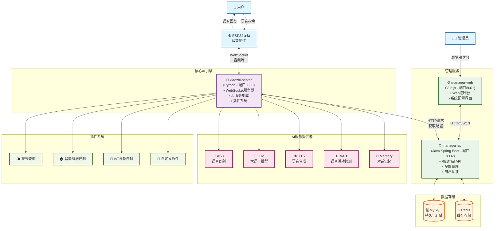
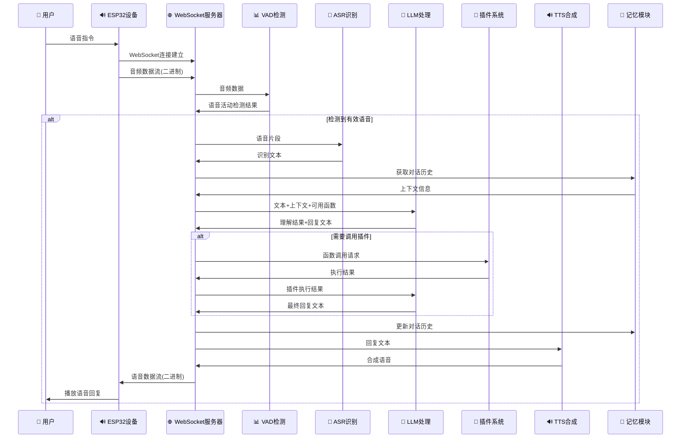
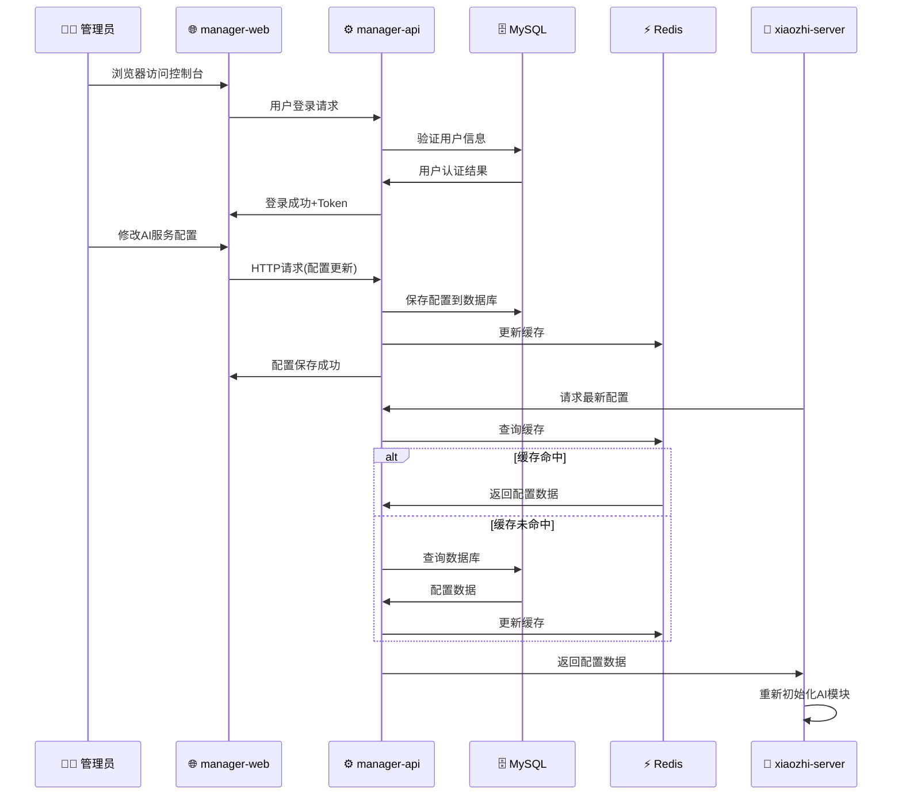
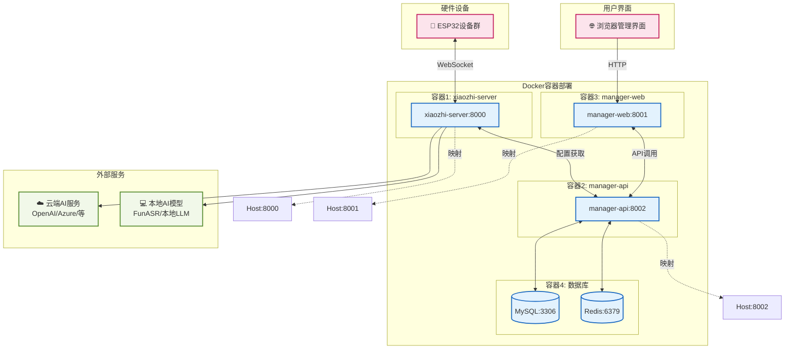
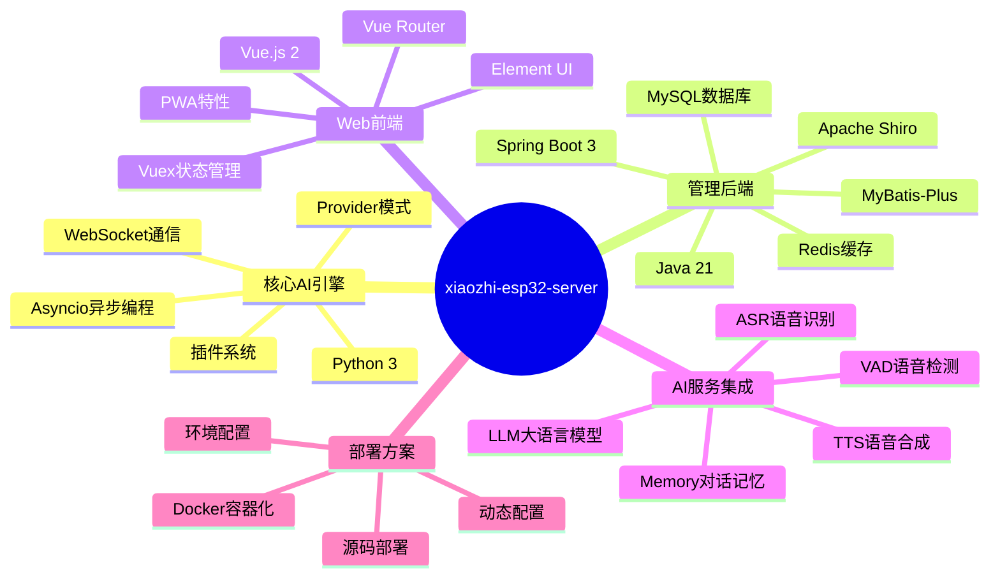
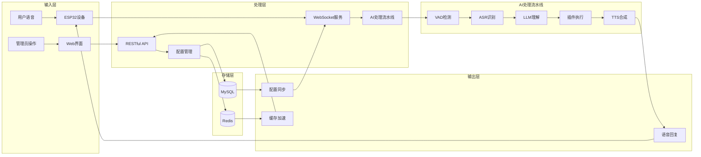

# xiaozhi-esp32-server 系统架构流程图

## 系统整体架构图

## 语音交互详细流程图

## 管理配置流程图

## 系统部署架构图

## 技术栈总览

## 数据流向图

---

> 本流程图基于 xiaozhi-esp32-server 项目的技术文档创建，展示了系统的整体架构、核心组件交互、数据流向和部署方案。该系统是一个功能完整的ESP32智能语音助手后端解决方案。

