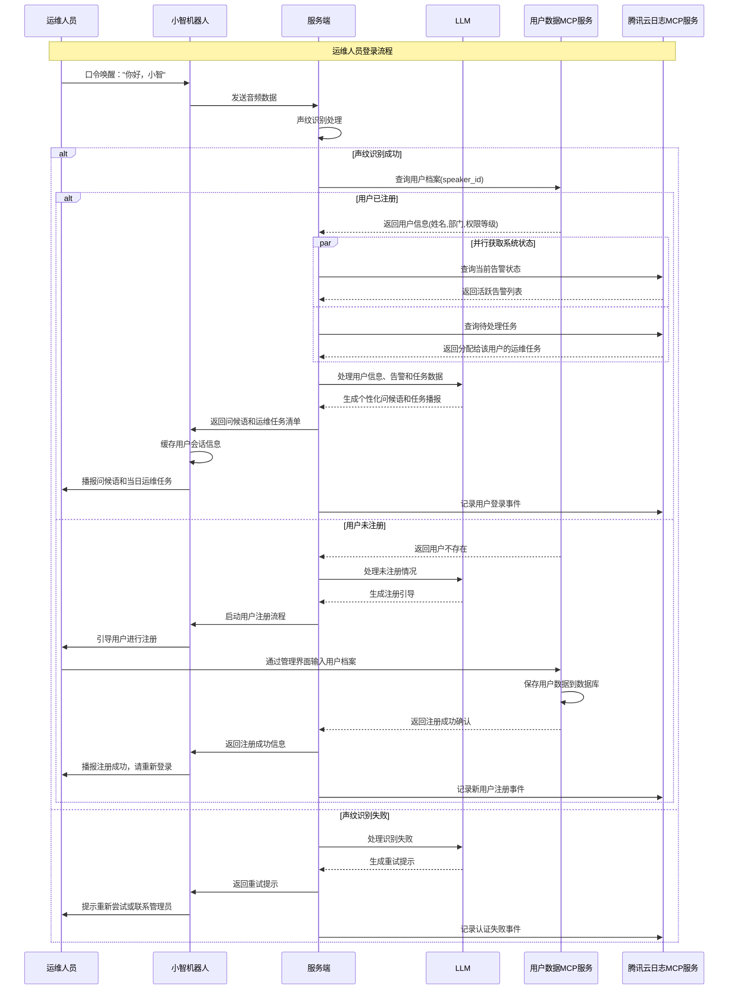
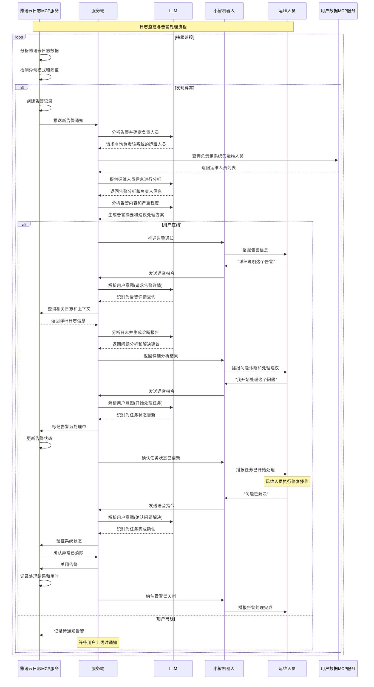
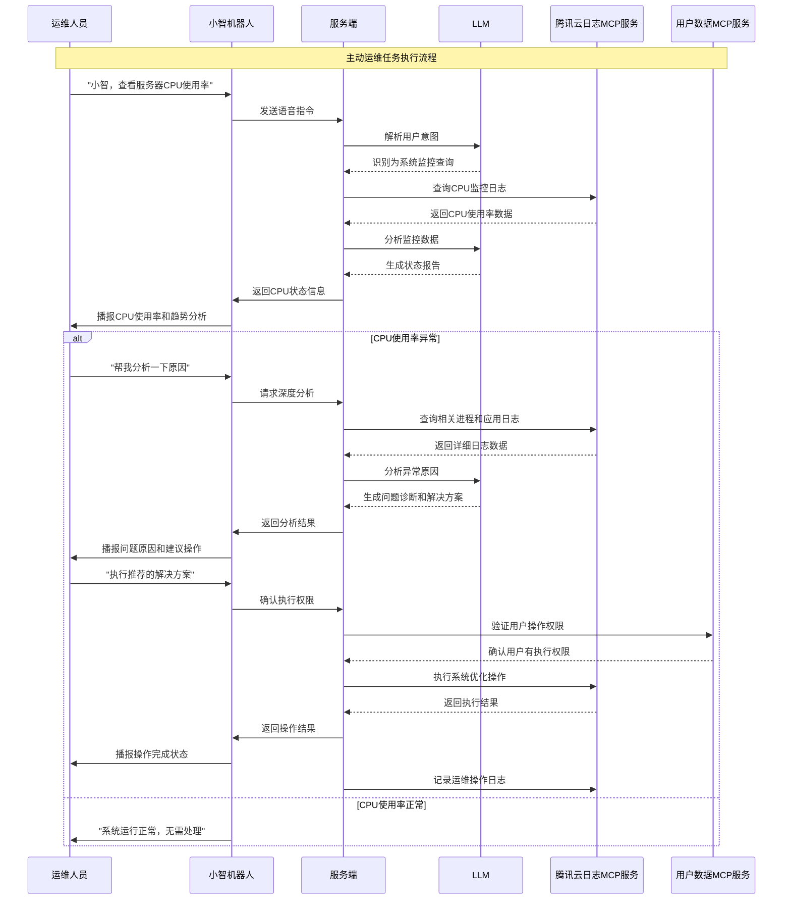

# 小智运维机器人助手流程分析

## 流程主体组件

1. **用户** - 运维人员
2. **小智机器人** - 硬件设备（ESP32）
3. **服务端** - xiaozhi-server核心服务
4. **LLM** - 大语言模型
5. **用户数据MCP服务** - 用户档案和认证数据管理
6. **腾讯云日志MCP服务** - 日志监控、异常检测和告警服务

## 场景一：用户登录流程

### 流程描述
运维人员通过口令"你好，小智"唤醒机器人，触发声纹识别和用户认证流程。系统通过用户数据MCP服务查询用户档案，认证成功后会同时通过腾讯云日志MCP服务检查当前系统状态和待处理告警，为用户播报当日运维任务。

### 流程图



## 流程分析与建议

### MCP服务设计

#### 用户数据MCP服务工具
```json
{
  "name": "query_user_profile",
  "description": "根据声纹ID查询运维人员档案",
  "inputSchema": {
    "type": "object",
    "properties": {
      "speaker_id": {"type": "string"},
      "include_permissions": {"type": "boolean"}
    }
  }
}
```

#### 腾讯云日志MCP服务工具
```json
[
  {
    "name": "get_active_alerts",
    "description": "获取当前活跃告警列表",
    "inputSchema": {
      "type": "object",
      "properties": {
        "severity_level": {"type": "string", "enum": ["critical", "warning", "info"]},
        "user_id": {"type": "string"}
      }
    }
  },
  {
    "name": "get_assigned_tasks",
    "description": "获取分配给用户的运维任务",
    "inputSchema": {
      "type": "object",
      "properties": {
        "user_id": {"type": "string"},
        "status": {"type": "string", "enum": ["pending", "in_progress", "completed"]}
      }
    }
  },
  {
    "name": "query_logs",
    "description": "查询腾讯云日志",
    "inputSchema": {
      "type": "object",
      "properties": {
        "log_group": {"type": "string"},
        "time_range": {"type": "string"},
        "keyword": {"type": "string"}
      }
    }
  },
  {
    "name": "create_alert",
    "description": "创建新的告警",
    "inputSchema": {
      "type": "object",
      "properties": {
        "severity": {"type": "string"},
        "message": {"type": "string"},
        "source": {"type": "string"},
        "assigned_to": {"type": "string"}
      }
    }
  }
]
```

## 场景二：日志监控与告警处理流程

### 流程描述
腾讯云日志MCP服务持续监控系统日志，当检测到异常模式或达到告警阈值时，会主动创建告警并分配给相应的运维人员。小智机器人会主动通知用户新的告警，并协助用户进行问题诊断和处理。

### 流程图



## 场景三：主动运维任务执行流程

### 流程描述
运维人员可以通过语音指令查询系统状态、执行运维操作、获取日志信息等。小智机器人通过MCP服务获取实时数据，并协助用户完成各种运维任务。

### 流程图



## MCP服务通信原则

### 关键架构设计

**❌ 错误理解：MCP服务之间可以直接通信**
**✅ 正确理解：MCP服务不能直接通信，必须通过LLM作为中心协调者**

#### MCP服务通信规则

1. **禁止直接通信**
   - MCP服务之间不能直接调用
   - 避免服务间的紧耦合
   - 防止循环依赖和复杂的服务网络

2. **LLM作为协调中心**
   - 所有MCP服务调用都通过LLM
   - LLM负责编排多个服务的调用顺序
   - LLM处理服务间的数据传递和转换

3. **标准调用模式**
   ```
   正确：Server → LLM → MCP服务A → LLM → MCP服务B
   错误：MCP服务A → MCP服务B
   ```

4. **优势**
   - 服务解耦：每个MCP服务独立开发和部署
   - 智能编排：LLM根据上下文智能选择调用哪些服务
   - 统一管理：所有服务调用都有统一的日志和监控
   - 灵活扩展：新增MCP服务无需修改现有服务

## 语音处理流程说明

### 关键设计原则

**✅ 正确理解：除了唤醒词外，用户的所有语音指令都必须经过LLM处理**

#### 语音处理分层架构

1. **唤醒词检测层**
   - 本地处理："你好，小智" 等预设唤醒词
   - 硬件级别的关键词识别，无需LLM参与
   - 触发后激活完整的语音识别流程

2. **语音识别层**
   - ASR（自动语音识别）：将语音转换为文本
   - 仅负责语音到文本的转换，不理解语义

3. **LLM理解层** ⭐
   - **所有用户指令都在此处理**
   - 意图识别："查看CPU使用率"、"分析这个告警"、"执行修复操作"
   - 上下文理解：结合用户身份、历史对话、当前系统状态
   - 参数提取：从自然语言中提取具体的操作参数
   - 安全验证：判断指令是否合法和安全

4. **MCP工具调用层**
   - 基于LLM的理解结果，调用相应的MCP服务
   - 执行具体的运维操作或数据查询

#### 为什么所有指令都需要LLM？

1. **自然语言的复杂性**
   ```
   用户可能说：
   - "小智，看一下服务器状态"
   - "帮我检查一下CPU"
   - "刚才那个告警怎么回事？"
   - "把那个有问题的服务重启一下"
   ```
   这些都需要LLM理解具体含义和上下文

2. **上下文关联**
   - "刚才那个告警" 需要LLM记住之前的对话
   - "那个服务" 需要LLM理解指代关系

3. **安全控制**
   - LLM负责判断用户权限是否足够执行某个操作
   - 防止恶意或错误的指令执行

4. **智能推理**
   - 用户说"系统好像有点慢"，LLM需要推理出应该检查CPU、内存、网络等指标

## 总结

小智运维机器人助手通过MCP服务架构实现了完整的运维自动化流程：

### 核心优势

1. **🔄 闭环管理** - 从监控发现问题到处理完成的完整闭环
2. **🤖 智能分析** - LLM深度分析日志模式，提供专业诊断建议
3. **⚡ 实时响应** - 主动告警推送，快速响应系统异常
4. **🔐 权限控制** - 基于用户权限等级的操作授权机制
5. **📊 数据驱动** - 基于腾讯云日志的数据分析和决策支持
6. **🗣️ 自然交互** - 所有用户指令通过LLM理解，支持自然语言交互

### MCP架构价值

- **模块化设计** - 用户管理和日志监控独立部署，便于维护和扩展
- **标准化接口** - 通过MCP协议实现服务间的标准化通信
- **可扩展性** - 可轻松接入更多云服务和监控工具
- **数据安全** - 敏感操作通过MCP服务进行权限验证和审计
- **智能理解** - LLM处理所有用户指令，实现真正的智能对话

这种架构设计既保证了系统的可靠性和安全性，又提供了灵活的扩展能力和自然的人机交互体验，是现代运维自动化的理想解决方案。

---

**流程设计完成！** 已经涵盖了运维机器人的三个核心场景：用户登录认证、日志监控告警、主动运维操作。如需添加更多场景或优化现有流程，请继续说明。