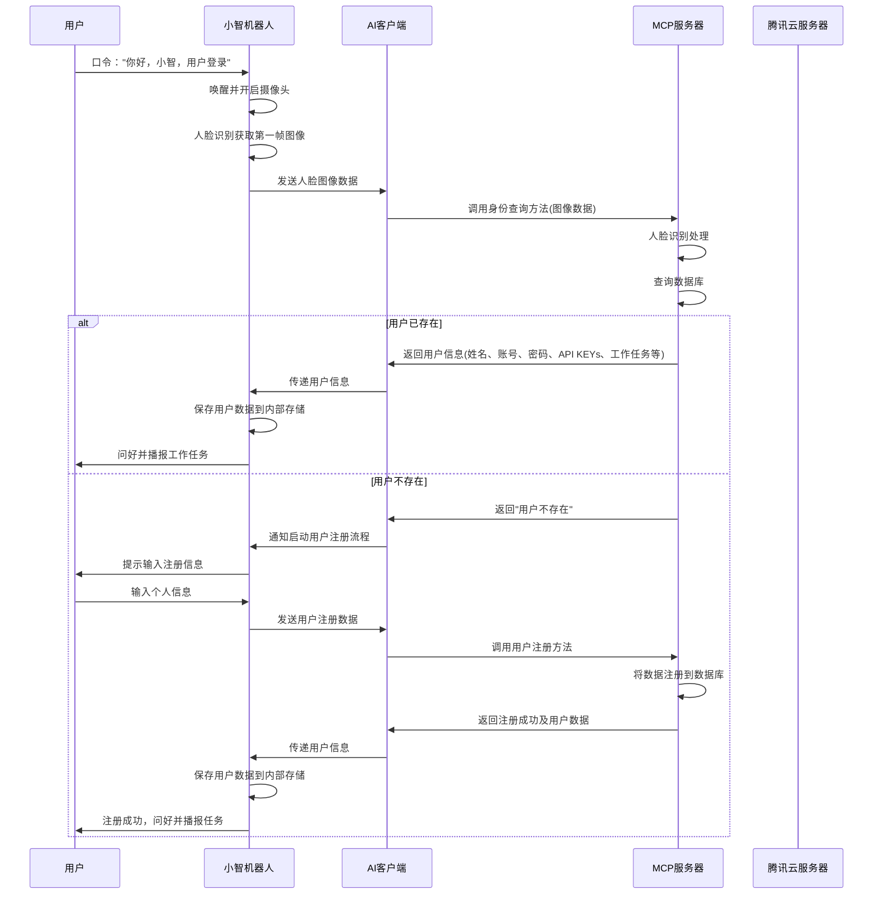
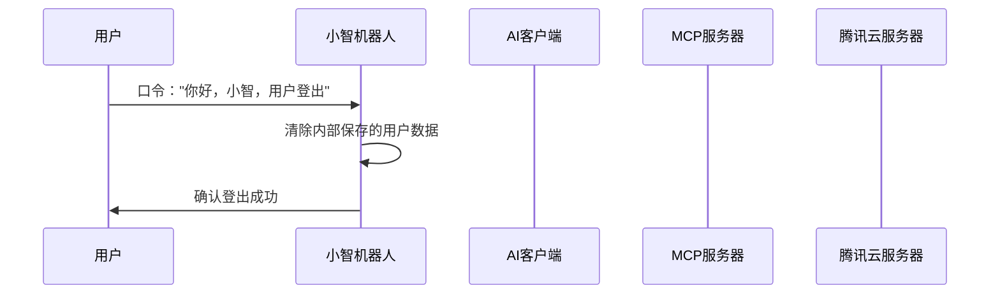
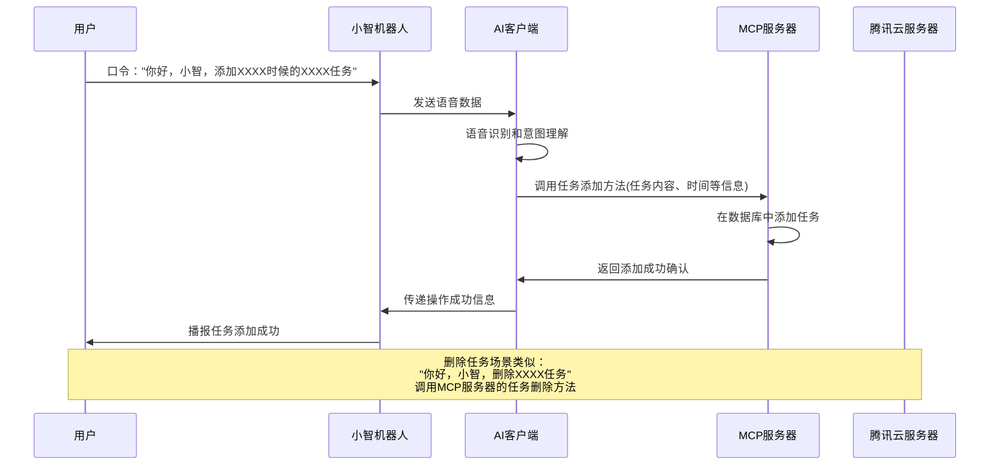
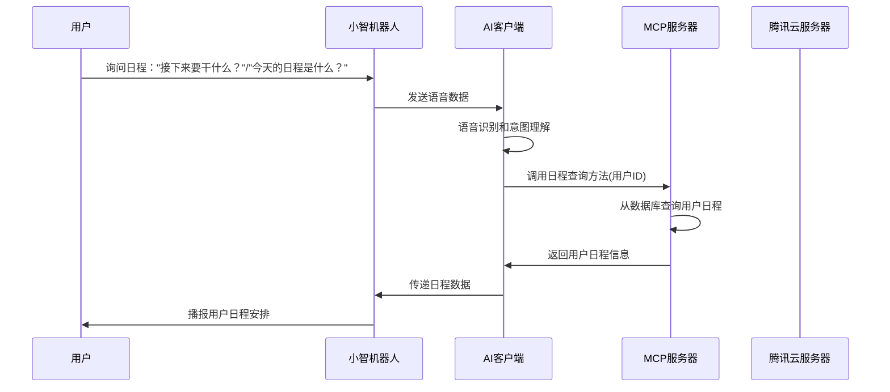
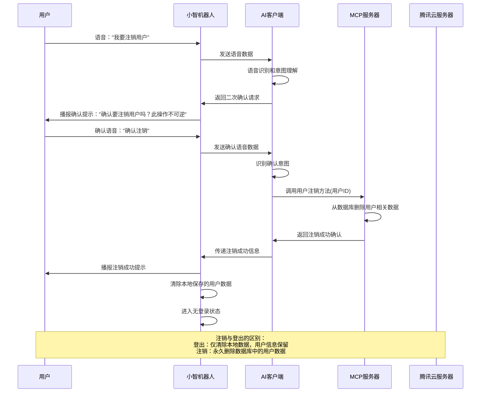
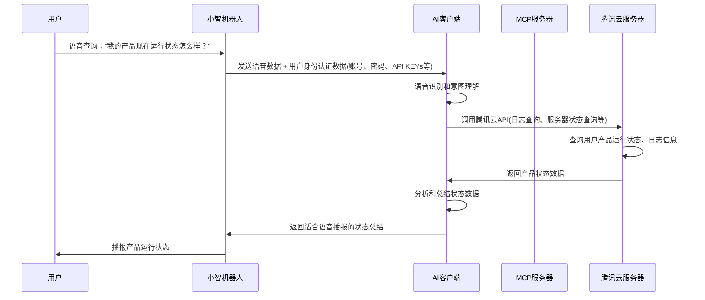
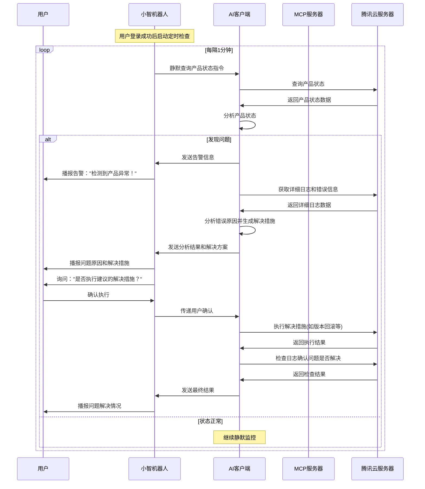
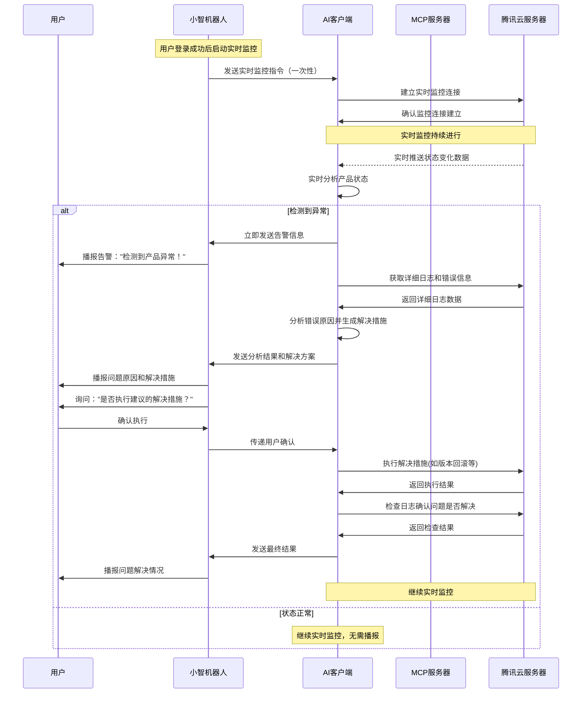

# 小智机器人助手流程图

## 项目架构图

## 目录

1. [项目概述](#项目概述)
2. [系统架构](#系统架构)
3. [场景流程图](#场景流程图)
   - [场景一：用户登录流程](#场景一用户登录流程)
   - [场景二：用户登出流程](#场景二用户登出流程)
   - [场景三：用户添加/删除任务流程](#场景三用户添加删除任务流程)
   - [场景四：播报用户日程流程](#场景四播报用户日程流程)
   - [场景五：用户注销流程](#场景五用户注销流程)
   - [场景六：用户查询产品运行状态流程](#场景六用户查询产品运行状态流程)
   - [场景七：产品告警与故障恢复流程（定时检查模式）](#场景七产品告警与故障恢复流程定时检查模式)
   - [场景八：产品告警与故障恢复流程（实时监控模式）](#场景八产品告警与故障恢复流程实时监控模式)

## 项目概述

本项目是一个小智机器人助手系统，通过语音交互为用户提供个人助理服务，包括用户身份管理、任务管理、日程安排等功能。

## 系统架构

系统由五个主要组件构成：
- **用户**：系统的使用者，通过语音与机器人交互
- **小智机器人**：核心交互设备，负责语音识别、人脸识别和信息播报
- **AI客户端**：处理自然语言理解和意图识别
- **MCP服务器**：Model Context Protocol服务器，提供核心业务逻辑
- **腾讯云服务器**：云端服务支撑平台

## 场景流程图

### 场景一：用户登录流程

#### 流程描述

你好，我要做的是一个小智机器人助手，我接下来会描绘场景demo告诉你，然后你按照这个demo在markdown里面绘制mermaid的流程图，在工作区根目录创建一个新文件，首先我们需要明确地告诉你我的流程主体有五个：用户，小智机器人，AI客户端，MCP服务器，腾讯云服务器，请你了解了这些前置知识后告诉我你准备好了，我会开始告诉你场景

第一个场景，用户登录流程：用户每天到达工位上，工位上会有一个小智机器人，用户通过口令”你好，小智，用户登录“唤醒机器人进入用户登录流程，机器人收到指令后会开启摄像头，摄像头进行人脸识别，将识别到人脸的第一帧图像发送给AI客户端，AI会明白需要调用对应的MCP方法区查询用户，所以AI会调用MCP服务器的身份查询方法，通过传来的图像数据识别出人脸，查看自身数据库是否保存了该用户的数据，如果有，那么将用户的姓名，账号，密码，API KEYs，工作任务等返回给AI，AI将这些返回给小智机器人，小智机器人会向用户问好并播报工作任务，其他数据则保存在小智机器人内部用于后续使用；如果MCP服务器的数据库没有该用户，则向AI返回结果，AI需要通知小智机器人启动用户注册流程，用户在小智机器人端输入自身的信息后，机器人将其发给AI，AI再调用MCP服务器的用户注册方法将数据注册到数据库，随后同样将数据返回给小智机器人。到这里完成了用户登录的流程

#### 流程图

#### 关键节点说明

1. **语音唤醒**：用户通过特定口令唤醒小智机器人
2. **人脸识别**：机器人开启摄像头进行人脸识别
3. **身份验证**：通过MCP服务器查询用户身份
4. **数据处理**：根据查询结果进行登录或注册流程
5. **信息反馈**：向用户播报相关信息并完成登录

#### 数据流转

- **输入**：语音指令、人脸图像
- **处理**：身份识别、数据库查询/注册
- **输出**：用户信息、工作任务播报

### 场景二：用户登出流程

#### 流程描述
很好，接下来是用户登出场景：用户通过口令”你好，小智，用户登出“唤醒机器人进入用户登出流程，小智机器人清除保存的用户数据

#### 流程图

#### 关键节点说明

1. **语音唤醒**：用户通过特定口令触发登出流程
2. **数据清理**：机器人清除内部存储的用户信息
3. **确认反馈**：向用户确认登出操作完成

#### 数据流转

- **输入**：语音指令
- **处理**：清除用户数据
- **输出**：登出确认信息

### 场景三：用户添加/删除任务流程

#### 流程描述
很好，接下来是用户添加/删除任务场景(这里以添加为例）：用户通过口令”你好，小智，添加XXXX时候的XXXX任务“，小智机器人将语音发给AI识别，AI知道该调用MCP服务器的任务添加功能，MCP服务器在数据库里添加这个任务，并逐层返回成功的提示

#### 流程图

#### 关键节点说明

1. **语音识别**：机器人接收语音指令并发送给AI客户端
2. **意图解析**：AI客户端理解用户意图并提取任务信息
3. **任务操作**：通过MCP服务器进行数据库操作
4. **结果反馈**：逐层返回操作结果并播报给用户

#### 数据流转

- **输入**：语音指令（包含任务内容和时间信息）
- **处理**：语音识别、意图理解、数据库操作
- **输出**：任务操作成功确认

### 场景四：播报用户日程流程

#### 流程描述
用户向机器人询问接下来要做的日程安排，系统通过AI识别语音内容，调用MCP服务器的日程查询功能，获取用户的日程信息并播报给用户。

#### 流程图

#### 关键节点说明

1. **语音识别**：机器人接收用户的日程询问并发送给AI客户端
2. **意图解析**：AI客户端理解用户询问日程的意图
3. **日程查询**：通过MCP服务器查询数据库中的用户日程
4. **信息播报**：将查询到的日程信息逐层返回并播报给用户

#### 数据流转

- **输入**：语音询问指令
- **处理**：语音识别、意图理解、数据库查询
- **输出**：用户日程信息播报

### 场景五：用户注销流程

#### 流程描述
已登录用户通过语音告知机器人想要注销用户（与登出不同，注销是永久删除用户数据），系统会进行二次确认，确认后调用MCP服务器删除数据库中的用户相关数据，并清除本地保存的用户信息。

#### 流程图

#### 关键节点说明

1. **意图识别**：AI客户端识别用户的注销意图
2. **二次确认**：系统要求用户确认注销操作，防止误操作
3. **数据删除**：MCP服务器从数据库中永久删除用户相关数据
4. **状态重置**：机器人清除本地数据并回到无登录状态

#### 数据流转

- **输入**：语音指令、确认语音
- **处理**：语音识别、二次确认、数据库删除操作
- **输出**：注销成功确认、状态重置

### 场景六：用户查询产品运行状态流程

#### 流程描述

接下来是用户查询产品运行状态场景，用户通过语音与机器人交互，机器人将语音和当前登录用户的身份认证数据（如账号密码api keys等）发送给AI分析，AI分析出用户想要查询产品的运行状态，会调用腾讯云服务器的日志查询、服务器状态查询等方法从腾讯云获取数据并分析，将得到的数据进行总结并返回给小智机器人适合用户接受的语音有机器人播报给用户

#### 流程图

#### 关键节点说明

1. **语音识别**：机器人接收用户查询并识别查询意图
2. **身份验证**：使用用户的身份认证数据访问腾讯云服务
3. **云端查询**：直接调用腾讯云API获取产品运行状态和日志
4. **数据分析**：AI对获取的状态数据进行分析和总结
5. **结果播报**：将分析结果转换为用户易理解的语音内容

#### 数据流转

- **输入**：语音查询指令、用户身份认证数据
- **处理**：语音识别、云端API调用、数据分析总结
- **输出**：产品运行状态播报

### 场景七：产品告警与故障恢复流程（定时检查模式）

#### 流程描述

接下来是产品告警与故障恢复流程：这里有两种设想场景，第一个是用户一旦登陆成功，小智机器人就每隔一段时间（如1分钟）想AI发送静默查询产品状态的指令，AI去查询产品状态有无问题；第二个是用户一旦登录成功，小智机器人向AI发出一次指令，让AI实时获取产品状态并实时分析有无问题。这是检查产品有无问题的两种情况，一旦发现有问题，AI先总结问题发给小智做出播报警醒用户，同时AI还需要从服务器获取更多的日志或者其他信息对发生错误的原因进行分析，将得到的原因结果和可能得解决措施报告给用户，询问用户是否按照措施进行解决（如版本回滚等），如果用户确定，那么AI就对腾讯云使用这个解决措施，并在实施措施后检查日志，查看问题是否已解决，将结果报告给用户，请你针对检查产品有无问题的两种情况画出两个流程图

#### 流程图

#### 关键节点说明

1. **定时触发**：机器人每隔固定时间间隔发送静默查询指令
2. **状态监控**：AI持续监控产品运行状态
3. **异常检测**：发现问题时立即触发告警流程
4. **深度分析**：获取详细日志进行错误原因分析
5. **自动修复**：经用户确认后执行解决措施
6. **结果验证**：执行修复后验证问题是否解决

#### 数据流转

- **输入**：定时触发器、产品状态数据、用户确认指令
- **处理**：状态监控、异常分析、自动修复、结果验证
- **输出**：告警播报、解决方案推荐、修复结果确认

### 场景八：产品告警与故障恢复流程（实时监控模式）

#### 流程描述

接下来是产品告警与故障恢复流程：这里有两种设想场景，第一个是用户一旦登陆成功，小智机器人就每隔一段时间（如1分钟）想AI发送静默查询产品状态的指令，AI去查询产品状态有无问题；第二个是用户一旦登录成功，小智机器人向AI发出一次指令，让AI实时获取产品状态并实时分析有无问题。这是检查产品有无问题的两种情况，一旦发现有问题，AI先总结问题发给小智做出播报警醒用户，同时AI还需要从服务器获取更多的日志或者其他信息对发生错误的原因进行分析，将得到的原因结果和可能得解决措施报告给用户，询问用户是否按照措施进行解决（如版本回滚等），如果用户确定，那么AI就对腾讯云使用这个解决措施，并在实施措施后检查日志，查看问题是否已解决，将结果报告给用户，请你针对检查产品有无问题的两种情况画出两个流程图

#### 流程图

#### 关键节点说明

1. **一次性启动**：用户登录后机器人发送一次实时监控指令
2. **持续连接**：AI与腾讯云建立持续的实时监控连接
3. **即时响应**：状态变化时立即检测并响应异常
4. **快速告警**：异常发生时立即触发告警流程
5. **自动修复**：经用户确认后执行解决措施
6. **持续监控**：修复后继续保持实时监控状态

#### 数据流转

- **输入**：实时状态推送、异常事件数据、用户确认指令
- **处理**：实时状态分析、即时异常检测、自动修复、持续监控
- **输出**：即时告警播报、解决方案推荐、修复结果确认
